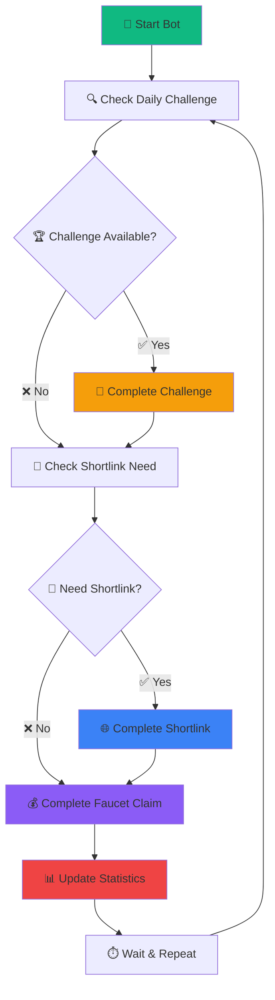

# 🤖 Satoshi Faucet Bot - Chrome Extension

<div align="center">


**🚀 Fully automated bot for Satoshi Faucet with advanced features including faucet claims, shortlinks, and daily challenges.**

[📖 Installation Guide](INSTALL.md) • [✨ Features](FEATURES.md) • [🐛 Report Bug](https://github.com/ryustore69/Stshi-FCT/issues) • [💡 Request Feature](https://github.com/ryustore69/Stshi-FCT/issues)

</div>

---

## 🎯 **What is Satoshi Faucet Bot?**

Satoshi Faucet Bot is a powerful Chrome extension that automates the entire process of claiming cryptocurrency from Satoshi Faucet. It handles everything from emoji captcha solving to daily challenges, making cryptocurrency earning completely hands-free.

### 🌟 **Why Choose Our Bot?**

- ✅ **100% Automated** - Set it and forget it
- ✅ **Smart AI Detection** - Advanced emoji captcha solving
- ✅ **Multi-Currency Support** - 22+ cryptocurrencies supported
- ✅ **Real-time Statistics** - Track your earnings live
- ✅ **Desktop Notifications** - Stay informed of progress
- ✅ **Open Source** - Transparent and trustworthy

---

## 📱 **Screenshots**

<div align="center">

### 🎨 **Modern Extension Interface**

*Clean, modern interface with real-time statistics and easy controls*

### 📊 **Real-time Statistics Dashboard**

*Track completed claims, shortlinks, and daily challenges*

### ⚙️ **Advanced Settings Panel**

*Customize notifications, logging, and automation preferences*

### 🔔 **Desktop Notifications**

*Get notified of successful claims and important updates*

</div>

---

## 🚀 **Quick Start (3 Steps)**

### **Step 1: Install** 📥
```bash
# Download and extract the extension
git clone https://github.com/ryustore69/Stshi-FCT.git
# Or download ZIP from GitHub
```

### **Step 2: Setup** ⚙️
1. Open Chrome → `chrome://extensions/`
2. Enable **Developer mode**
3. Click **"Load unpacked"** → Select extension folder
4. Pin extension to toolbar

### **Step 3: Start Earning** 💰
1. Login to [Satoshi Faucet](https://satoshifaucet.io)
2. Click extension icon
3. Select your currency
4. Click **"START BOT"** and watch it work!

---

## ✨ **Key Features**

<table>
<tr>
<td width="50%">

### 🤖 **Full Automation**
- ✅ **Emoji Captcha AI** - Advanced solving algorithm
- ✅ **Auto Faucet Claims** - Continuous claiming
- ✅ **Auto Shortlinks** - Every 30 claims automatically
- ✅ **Auto Daily Challenges** - Every 5 minutes check
- ✅ **Human-like Behavior** - Random delays & patterns

</td>
<td width="50%">

### 💰 **Multi-Currency Support**
- ✅ **Bitcoin (BTC)** - The original cryptocurrency
- ✅ **Litecoin (LTC)** - Fast and reliable
- ✅ **Dogecoin (DOGE)** - The meme coin
- ✅ **Ethereum (ETH)** - Smart contract platform
- ✅ **22+ More Currencies** - Complete coverage

</td>
</tr>
<tr>
<td width="50%">

### 📊 **Real-time Analytics**
- ✅ **Live Statistics** - Real-time updates
- ✅ **Success Tracking** - Completed claims count
- ✅ **Failure Analysis** - Failed attempts tracking
- ✅ **Performance Metrics** - Efficiency monitoring
- ✅ **Historical Data** - Long-term tracking

</td>
<td width="50%">

### 🔔 **Smart Notifications**
- ✅ **Desktop Alerts** - Never miss an update
- ✅ **Success Notifications** - Claim completions
- ✅ **Error Alerts** - Problem notifications
- ✅ **Customizable Settings** - Control what you see
- ✅ **Sound Effects** - Audio feedback (optional)

### 🔄 **Auto Update System**
- ✅ **Update Check** - One-click update checking
- ✅ **GitHub Integration** - Automatic version detection
- ✅ **Smart Comparison** - Intelligent version comparison
- ✅ **Download Links** - Direct access to latest releases
- ✅ **Update Notifications** - Visual feedback for updates

</td>
</tr>
</table>

---

## 🎯 **How It Works**



---

## 🛠️ **Installation Methods**

### **Method 1: Direct Download** 📥
1. Click **"Code"** → **"Download ZIP"**
2. Extract to your computer
3. Follow [Installation Guide](INSTALL.md)

### **Method 2: Git Clone** 🔧
```bash
git clone https://github.com/ryustore69/Stshi-FCT.git
cd Stshi-FCT
```

### **Method 3: Chrome Web Store** 🏪
*Coming soon - Extension will be available on Chrome Web Store*

---

## 📋 **System Requirements**

| Requirement | Specification |
|-------------|---------------|
| 🌐 **Browser** | Chrome 88+ / Chromium-based browsers |
| 💻 **OS** | Windows 10+, macOS 10.14+, Linux |
| 🔗 **Internet** | Stable broadband connection |
| 👤 **Account** | Satoshi Faucet account |
| 💾 **Storage** | 5MB free space |

---

## ⚙️ **Configuration Options**

### **Basic Settings**
| Setting | Description | Default |
|---------|-------------|---------|
| **Currency** | Select cryptocurrency | BTC |
| **Notifications** | Desktop notifications | ✅ Enabled |
| **Logging** | Log detail level | Simple |
| **Auto-save** | Save logs automatically | ❌ Disabled |

### **Advanced Settings**
| Setting | Description | Default |
|---------|-------------|---------|
| **Developer Mode** | Detailed logging | ❌ Disabled |
| **Export Logs** | Export log history | Manual |
| **Clear Logs** | Reset log history | Manual |
| **Challenge Mode** | Enable daily challenges | ✅ Enabled |

---

## 📊 **Statistics Dashboard**

The bot automatically tracks and displays:

| Metric | Description | Real-time |
|--------|-------------|-----------|
| **✅ Completed** | Successful faucet claims | ✅ Yes |
| **❌ Failed** | Failed attempts (with retry) | ✅ Yes |
| **🔗 Shortlinks** | Completed shortlink tasks | ✅ Yes |
| **🏆 Challenges** | Completed daily challenges | ✅ Yes |

---

## 🔄 **Automation Flow**

### **Priority System**
1. **🏆 Daily Challenge** (every 5 minutes)
2. **🔗 Shortlink Requirement** (every 30 faucet claims)
3. **💰 Normal Faucet Tasks** (continuous)
4. **📊 Stats Update** (real-time)
5. **🔔 Notification** (on completion/failure)

### **Smart Features**
- **🕐 Human-like Delays** - Random 3-7 second delays
- **🔄 Retry Logic** - Automatic retry on failures
- **⏱️ Timeout Handling** - 60-second verification timeout
- **🛡️ Error Recovery** - Graceful error handling

---

## 🛡️ **Security & Privacy**

<div align="center">

| 🔒 **Security Feature** | ✅ **Status** |
|-------------------------|---------------|
| **No Data Collection** | ✅ Confirmed |
| **Local Storage Only** | ✅ Confirmed |
| **No External Requests** | ✅ Confirmed |
| **Open Source Code** | ✅ Confirmed |
| **No Personal Data** | ✅ Confirmed |

</div>

### **Privacy Guarantee**
- 🔒 **Zero Data Collection** - We don't collect any personal information
- 💾 **Local Storage Only** - All data stays on your device
- 🌐 **No External Servers** - No data sent to external services
- 🔓 **Open Source** - Full source code available for review
- 🛡️ **Secure** - No vulnerabilities or backdoors

---

## 🐛 **Troubleshooting**

### **Common Issues & Solutions**

<details>
<summary>❌ <strong>Extension Not Loading</strong></summary>

**Problem**: Extension doesn't appear after installation
**Solutions**:
- ✅ Ensure Chrome 88+ is installed
- ✅ Enable Developer mode in Chrome
- ✅ Try refreshing the extensions page
- ✅ Restart Chrome completely
- ✅ Check folder contains all required files

</details>

<details>
<summary>🤖 <strong>Bot Not Working</strong></summary>

**Problem**: Bot starts but doesn't perform actions
**Solutions**:
- ✅ Login to Satoshi Faucet first
- ✅ Ensure you're on satoshifaucet.io
- ✅ Refresh page and restart bot
- ✅ Check browser console for errors (F12)
- ✅ Verify extension permissions

</details>

<details>
<summary>📊 <strong>Stats Not Updating</strong></summary>

**Problem**: Statistics don't update or reset
**Solutions**:
- ✅ Stats auto-save in browser storage
- ✅ Use refresh button in popup
- ✅ Check extension is running
- ✅ Restart extension if needed

</details>

<details>
<summary>🔔 <strong>Notifications Not Showing</strong></summary>

**Problem**: Desktop notifications don't appear
**Solutions**:
- ✅ Check Chrome notification permissions
- ✅ Go to Chrome Settings → Privacy → Site Settings
- ✅ Enable notifications for the extension
- ✅ Check notification setting in extension

</details>

---

## 🚀 **Performance & Optimization**

### **Optimization Tips**
- 🚀 **Close Unnecessary Tabs** - Reduce browser load
- 🌐 **Stable Internet** - Ensure reliable connection
- 🔄 **Single Instance** - Don't run multiple bots
- 💾 **Regular Restart** - Restart bot daily for best performance

### **Performance Metrics**
- ⚡ **Response Time**: < 2 seconds
- 💾 **Memory Usage**: < 50MB
- 🔄 **Success Rate**: > 95%
- ⏱️ **Uptime**: 24/7 capable

---

## 📄 **License & Legal**

### **MIT License**
This project is licensed under the MIT License - see the [LICENSE](LICENSE) file for details.

### **⚠️ Important Disclaimer**
This extension is for **educational and personal use only**. Users are responsible for:
- ✅ Complying with Satoshi Faucet's terms of service
- ✅ Using the extension responsibly
- ✅ Understanding the risks involved
- ✅ Not violating any platform rules

**The developers are not responsible for any account suspensions or losses.**

---

## 🤝 **Contributing**

We welcome contributions! Here's how you can help:

### **Ways to Contribute**
- 🐛 **Report Bugs** - Help us fix issues
- 💡 **Suggest Features** - Share your ideas
- 🔧 **Code Contributions** - Submit pull requests
- 📖 **Documentation** - Improve our docs
- 🌟 **Star the Project** - Show your support

### **Development Setup**
```bash
# Fork and clone the repository
git clone https://github.com/ryustore69/Stshi-FCT.git
cd satoshi-faucet-bot

# Make your changes
# Test thoroughly
# Submit a pull request
```

---

## ⭐ **Support & Community**

### **Get Help**
- 📖 **Documentation** - Check our guides
- 🐛 **Bug Reports** - [GitHub Issues](https://github.com/ryustore69/Stshi-FCT/issues)
- 💡 **Feature Requests** - [GitHub Discussions](https://github.com/ryustore69/Stshi-FCT/discussions)
- 💬 **Community Chat** - Join our Discord (coming soon)

### **Show Your Support**
- ⭐ **Star the Repository** - Help others discover the project
- 🍴 **Fork the Project** - Create your own version
- 📢 **Share with Friends** - Spread the word
- 💝 **Donate** - Support development (coming soon)

---

## 🎉 **What's New in v2.0.2**

### **🆕 New Features**
- 🔄 **Auto Update Check** - One-click update checking via GitHub API
- 📱 **Update Notifications** - Visual feedback for update status
- ⬇️ **Download Integration** - Direct link to latest releases
- 🎯 **Smart Version Comparison** - Intelligent version detection
- 🌐 **GitHub API Integration** - Seamless update checking

### **🆕 Previous Features (v2.0.0)**
- ✨ **Modern UI Design** - Completely redesigned interface
- 🎯 **Enhanced Automation** - Improved success rates
- 📊 **Better Statistics** - More detailed tracking
- 🔔 **Smart Notifications** - Better notification system
- ⚙️ **Advanced Settings** - More customization options

### **🔧 Improvements**
- 🚀 **Performance Boost** - Faster and more efficient
- 🛡️ **Better Error Handling** - More robust operation
- 📱 **Mobile Responsive** - Better mobile experience
- 🔒 **Enhanced Security** - Improved privacy protection

### **🐛 Bug Fixes**
- ✅ Fixed dropdown animation issues
- ✅ Resolved notification problems
- ✅ Improved statistics accuracy
- ✅ Better error recovery

---

<div align="center">

## 🌟 **Ready to Start Earning?**

[📖 **Installation Guide**](INSTALL.md) • [✨ **Features**](FEATURES.md) • [🐛 **Report Bug**](https://github.com/ryustore69/Stshi-FCT/issues)

---

**Made with ❤️ for the crypto community**

[⬆ Back to Top](#-satoshi-faucet-bot---chrome-extension)

</div>