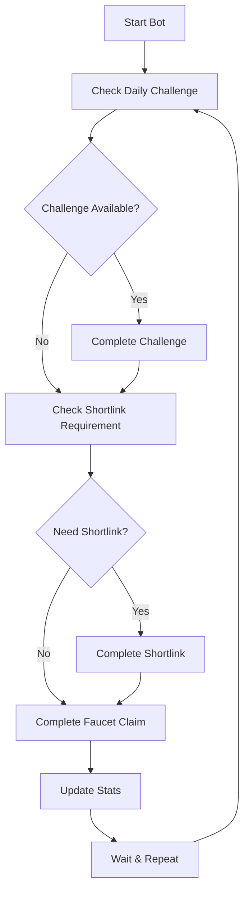

# 🤖 Satoshi Faucet Bot - Chrome Extension

<div align="center">


**Automated bot for Satoshi Faucet with full automation including faucet claims, shortlinks, and daily challenges.**

[📖 Installation Guide](INSTALL.md) • [✨ Features](FEATURES.md) • [🐛 Report Bug](https://github.com/YOUR_USERNAME/satoshi-faucet-bot/issues) • [💡 Request Feature](https://github.com/YOUR_USERNAME/satoshi-faucet-bot/issues)

</div>

---

## 🚀 **Quick Start**

1. **Download** this repository
2. **Install** the extension in Chrome (see [Installation Guide](INSTALL.md))
3. **Login** to [Satoshi Faucet](https://satoshifaucet.io)
4. **Start** the bot and let it work automatically!

## ✨ **Key Features**

<table>
<tr>
<td width="50%">

### 🤖 **Full Automation**
- ✅ Auto faucet claims with emoji captcha
- ✅ Auto shortlinks every 30 claims  
- ✅ Auto daily challenges every 5 minutes
- ✅ Human-like delays and behavior

</td>
<td width="50%">

### 💰 **Multi-Currency Support**
- ✅ BTC, LTC, DOGE, ETH
- ✅ USDT, TRX, BNB, SOL
- ✅ DASH, DGB, XRP, USDC
- ✅ And 15+ more cryptocurrencies

</td>
</tr>
<tr>
<td width="50%">

### 📊 **Real-time Stats**
- ✅ Completed faucet claims
- ✅ Failed attempts tracking
- ✅ Shortlinks completed
- ✅ Daily challenges completed

</td>
<td width="50%">

### 🔔 **Smart Notifications**
- ✅ Desktop notifications
- ✅ Success/failure alerts
- ✅ Customizable settings
- ✅ Detailed logging system

</td>
</tr>
</table>

## 🎯 **How It Works**



## 📱 **Screenshots**

<div align="center">

### Extension Popup


### Settings Panel


### Desktop Notifications


</div>

## 🛠️ **Installation**

### **Method 1: Direct Download**
1. Click the **"Code"** button → **"Download ZIP"**
2. Extract the ZIP file
3. Follow the [Installation Guide](INSTALL.md)

### **Method 2: Git Clone**
```bash
git clone https://github.com/YOUR_USERNAME/satoshi-faucet-bot.git
cd satoshi-faucet-bot
```

## 📋 **Requirements**

- 🌐 **Chrome Browser** (or Chromium-based browsers)
- 🔗 **Internet Connection**
- 👤 **Satoshi Faucet Account**
- 💻 **Windows/Mac/Linux**

## ⚙️ **Configuration**

### **Basic Settings**
- Select your preferred cryptocurrency
- Enable/disable desktop notifications
- Choose logging level (Simple/Detailed)

### **Advanced Settings**
- Auto-save logs to file
- Export logs for debugging
- Clear logs history
- Developer mode for detailed logging

## 📊 **Statistics Tracking**

The bot automatically tracks:

| Metric | Description |
|--------|-------------|
| **Completed** | Successful faucet claims |
| **Failed** | Failed attempts (with retry logic) |
| **Shortlinks** | Completed shortlink tasks |
| **Challenges** | Completed daily challenges |

## 🔄 **Automation Flow**

1. **Daily Challenge Check** (every 5 minutes)
2. **Shortlink Requirement** (every 30 faucet claims)
3. **Normal Faucet Tasks** (continuous)
4. **Stats Update** (real-time)
5. **Notification** (on completion/failure)

## 🛡️ **Security & Privacy**

- 🔒 **No Data Collection** - Extension doesn't collect personal data
- 💾 **Local Storage Only** - All data stored locally in browser
- 🌐 **No External Requests** - No data sent to external servers
- 🔓 **Open Source** - Full source code available for review

## 🐛 **Troubleshooting**

### **Common Issues**

| Problem | Solution |
|---------|----------|
| Extension not loading | Enable Developer mode in Chrome |
| Bot not working | Check if logged into Satoshi Faucet |
| Stats not updating | Refresh the page and restart bot |
| Notifications not showing | Check notification permissions |

### **Get Help**
- 📖 Check the [Installation Guide](INSTALL.md)
- 🐛 [Report a Bug](https://github.com/YOUR_USERNAME/satoshi-faucet-bot/issues)
- 💡 [Request a Feature](https://github.com/YOUR_USERNAME/satoshi-faucet-bot/issues)
- 💬 [Join Discussions](https://github.com/YOUR_USERNAME/satoshi-faucet-bot/discussions)

## 📄 **License**

This project is licensed under the MIT License - see the [LICENSE](LICENSE) file for details.

## ⚠️ **Disclaimer**

This extension is for **educational purposes only**. Use at your own risk and in accordance with Satoshi Faucet's terms of service. The developers are not responsible for any account suspensions or losses.

## 🤝 **Contributing**

Contributions are welcome! Please feel free to submit a Pull Request.

1. Fork the repository
2. Create your feature branch (`git checkout -b feature/AmazingFeature`)
3. Commit your changes (`git commit -m 'Add some AmazingFeature'`)
4. Push to the branch (`git push origin feature/AmazingFeature`)
5. Open a Pull Request

## ⭐ **Support**

If you found this project helpful, please give it a ⭐ star on GitHub!

---

<div align="center">

**Made with ❤️ for the crypto community**

[⬆ Back to Top](#-satoshi-faucet-bot---chrome-extension)

</div>
