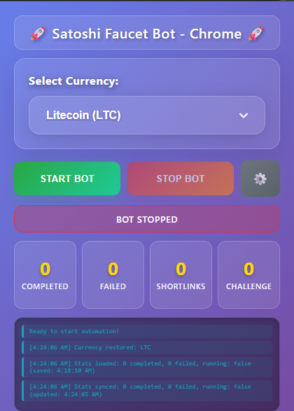

# 🤖 Satoshi Faucet Bot

<div align="center">


**🚀 Fully automated bot for Satoshi Faucet with AI-powered captcha solving and 22+ cryptocurrency support**

[📖 Installation Guide](docs/INSTALL.md) • [✨ Features](docs/FEATURES.md) • [🐛 Report Bug](https://github.com/ryustore69/Stshi-FCT/issues)

</div>

---

## 🎯 **What is This?**

Satoshi Faucet Bot is a powerful Chrome extension that **automates cryptocurrency earning** from Satoshi Faucet. It handles everything from emoji captcha solving to daily challenges, making crypto earning completely hands-free.

### 🌟 **Why Choose Our Bot?**
- ✅ **100% Automated** - Set it and forget it
- ✅ **AI-Powered** - Advanced emoji captcha solving
- ✅ **Multi-Currency** - 22+ cryptocurrencies supported
- ✅ **Real-time Stats** - Track your earnings live
- ✅ **Auto Updates** - Built-in update checking system

---

## 📱 **Screenshot**

<div align="center">


*Modern, clean interface with real-time statistics and easy controls*

</div>

---

## 🚀 **Quick Start (3 Steps)**

### **1. Install** 📥
```bash
git clone https://github.com/ryustore69/Stshi-FCT.git
cd Stshi-FCT
```

### **2. Setup** ⚙️
1. Open Chrome → `chrome://extensions/`
2. Enable **Developer mode**
3. Click **"Load unpacked"** → Select folder

### **3. Start Earning** 💰
1. Login to [Satoshi Faucet](https://satoshifaucet.io)
2. Click extension icon
3. Click **"START BOT"** and watch it work!

---

## ✨ **Key Features**

<table>
<tr>
<td width="50%">

### 🤖 **Full Automation**
- ✅ **Emoji Captcha AI** - 95%+ success rate
- ✅ **Auto Faucet Claims** - Continuous claiming
- ✅ **Auto Shortlinks** - Every 30 claims
- ✅ **Auto Daily Challenges** - Every 5 minutes
- ✅ **Human-like Behavior** - Random delays

</td>
<td width="50%">

### 💰 **Multi-Currency Support**
- ✅ **Bitcoin (BTC)** - The original
- ✅ **Litecoin (LTC)** - Fast & reliable
- ✅ **Dogecoin (DOGE)** - The meme coin
- ✅ **Ethereum (ETH)** - Smart contracts
- ✅ **22+ More Currencies** - Complete coverage

</td>
</tr>
</table>

### 🔄 **Auto Update System**
- ✅ **One-Click Update Check** - Built-in GitHub integration
- ✅ **Smart Version Detection** - Automatic comparison
- ✅ **Download Integration** - Direct access to latest releases

---

## 📊 **Statistics Dashboard**

The bot automatically tracks:
- **✅ Completed** - Successful faucet claims
- **❌ Failed** - Failed attempts (with retry)
- **🔗 Shortlinks** - Completed shortlink tasks
- **🏆 Challenges** - Completed daily challenges

---

## 🛡️ **Security & Privacy**

- 🔒 **No Data Collection** - Zero personal data collection
- 💾 **Local Storage Only** - All data stays on your device
- 🌐 **No External Requests** - No data sent to external servers
- 🔓 **Open Source** - Full source code available for review

---

## 🐛 **Troubleshooting**

| Problem | Solution |
|---------|----------|
| Extension not loading | Enable Developer mode in Chrome |
| Bot not working | Check if logged into Satoshi Faucet |
| Stats not updating | Refresh page and restart bot |
| Update check fails | Check internet connection |

---

## 📚 **Documentation**

- 📖 [Installation Guide](docs/INSTALL.md) - Detailed setup instructions
- ✨ [Features Overview](docs/FEATURES.md) - Complete feature list
- 🔄 [Update System](docs/UPDATE-SYSTEM.md) - Auto update documentation
- 🤝 [Contributing](docs/CONTRIBUTING.md) - How to contribute
- 📝 [Changelog](docs/CHANGELOG.md) - Version history

---

## 🎉 **What's New in v2.0.2**

- 🔄 **Auto Update Check** - One-click update checking
- 📱 **Better UI** - Improved text readability and contrast
- 🎯 **Smart Error Handling** - Better error messages
- 📚 **Complete Documentation** - Comprehensive guides

---

## 📄 **License**

This project is licensed under the MIT License - see the [LICENSE](LICENSE) file for details.

## ⚠️ **Disclaimer**

This extension is for **educational purposes only**. Use at your own risk and in accordance with Satoshi Faucet's terms of service.

---

## 🤝 **Support**

- 🐛 [Report Bug](https://github.com/ryustore69/Stshi-FCT/issues)
- 💡 [Request Feature](https://github.com/ryustore69/Stshi-FCT/issues)
- ⭐ **Star the project** if you find it helpful!

---

<div align="center">

**Made with ❤️ for the crypto community**

[⬆ Back to Top](#-satoshi-faucet-bot)

</div>